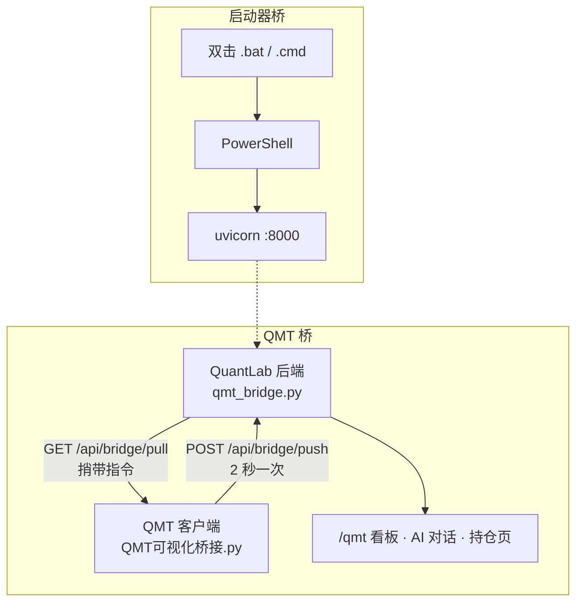
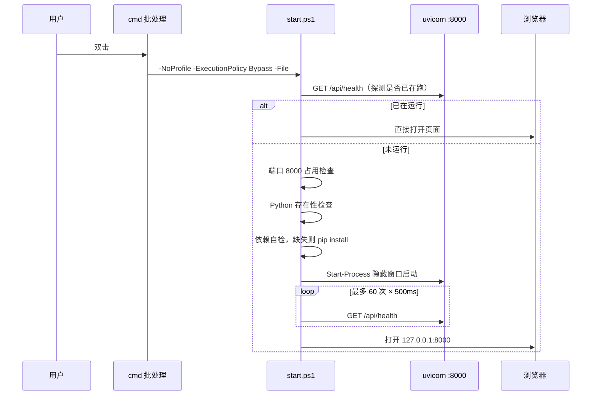
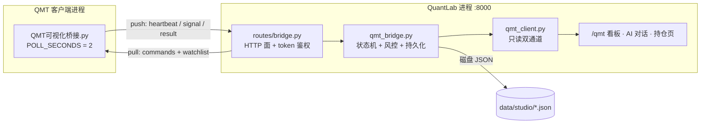
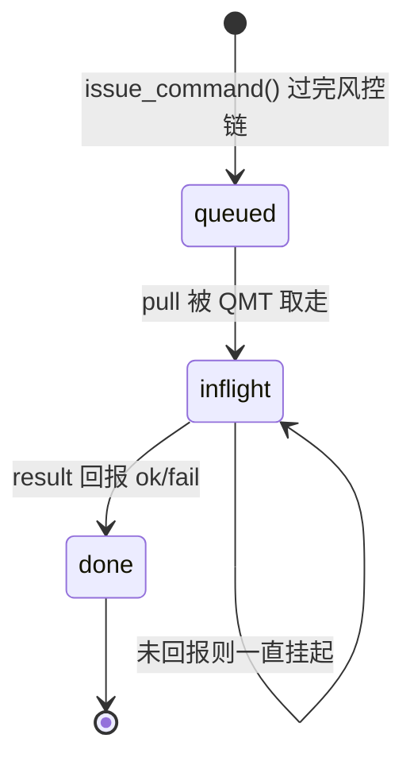

# 桥接层说明

QuantLab 里被叫做「桥接」（bridge）的东西有两处，作用完全不同，很容易混：

- **启动器桥**：把用户从「双击一个图标」带到「浏览器里跑起来的服务」。负责进程、端口、依赖、日志。
- **QMT 桥**：把 QMT 客户端里的**真实资金账户、持仓、委托、成交流水和秒级行情**，搬进 QuantLab 的网页和 AI 上下文里。负责数据、指令、风控。

本文把两层拆开讲清楚：谁跟谁说话、说什么、失败了怎么办、哪些地方有坑。

---

## 0. 两座桥的分工

| | 启动器桥 | QMT 桥 |
|---|---|---|
| **连接两端** | 桌面快捷方式 → Python 服务 | QMT 客户端 → QuantLab 后端 |
| **通信方式** | 进程调用 + HTTP 健康探测 | HTTP push/pull 轮询 |
| **生命周期** | 只在启动/停止那一刻存在 | 交易时段内持续在线，每 2 秒一次心跳 |
| **失败后果** | 服务起不来，看到错误提示 | 看板变成「离线」，但服务本身不受影响 |
| **核心文件** | `QuantLab 量化实验室.bat`、`scripts/start.ps1`、`scripts/stop.ps1` | `backend/qmt_bridge.py`、`backend/routes/bridge.py`、`data/studio/bridge/QMT可视化桥接.py` |



两座桥通过 **端口 8000** 这一个点收口——这也是整个项目「一个应用、一个端口」的由来。

---

# 第一部分：启动器桥

启动器桥要解决的问题很具体：这是一个 Python 后端 + 已构建前端的本地应用，目标用户不想装环境、不想敲命令、不想看黑窗口。所以需要一层薄壳，把「双击」翻译成「服务已就绪，浏览器已打开」。

## 1.1 参与文件

| 文件 | 位置 | 职责 |
|---|---|---|
| `启动 QuantLab.cmd` | 仓库根 | Windows 启动入口，切 UTF-8 代码页后转 PowerShell |
| `停止 QuantLab.cmd` | 仓库根 | Windows 停止入口 |
| `QuantLab 量化实验室.bat` | 桌面（分发副本） | 桌面启动入口，**多一层目录查找**，见 §1.5 |
| `scripts/start.ps1` | 仓库 | Windows 侧真正的启动逻辑：环境自检、依赖自装、拉起服务、健康探测、开浏览器 |
| `scripts/stop.ps1` | 仓库 | Windows 侧精确停服务（按命令行特征匹配，防误杀） |
| `start.sh` / `stop.sh` | 仓库根 | Git Bash / macOS / Linux 的等价实现，用 Python 自己做健康探测与端口探测（不依赖 `curl` / `lsof` / `netstat`） |



## 1.2 批处理层做了什么

`.bat` / `.cmd` 刻意保持极薄，只负责四件事：

1. **定位目录**：桌面版支持两种摆放——launcher 旁边有 `QuantLab` 文件夹，就用手边的；没有就回退到 `%USERPROFILE%\Desktop\QuantLab`。
2. **存在性预检**：`scripts\start.ps1` 不在就报错退出（退出码 `2`）。
3. **PowerShell 可用性预检**：`where powershell.exe` 找不到就报错退出（退出码 `3`）。
4. **切换工作目录**：`pushd` 失败报错退出（退出码 `4`）；执行完 `popd` 还原。

然后在校验通过后调用：

```
powershell.exe -NoProfile -ExecutionPolicy Bypass -File "%START_SCRIPT%"
```

三个参数都是有意的：

- `-NoProfile`：不加载用户的 PowerShell 配置文件，避免别人的 profile 脚本污染运行环境。
- `-ExecutionPolicy Bypass`：**只对这一次调用**绕过执行策略，不去改机器的全局策略——不给用户留副作用。
- `-File` 而非 `-Command`：脚本以文件形式执行，`$PSScriptRoot` 才有值，`start.ps1` 靠它反推仓库根目录。

子进程退出码被接住，非 0 时打印提示并指向日志文件，最后 `exit /b %EXIT_CODE%` 把码原样传给外层——**退出码是可以被脚本化消费的**，不是一个死循环的黑窗口。

## 1.3 PowerShell 层：五个阶段

`start.ps1` 是启动器桥的本体，按顺序做五件事，任何一步失败都会给出**人话错误 + 自愈指引**，而不是抛栈。

| 阶段 | 检查 | 失败表现 |
|---|---|---|
| ① 已在运行？ | `GET /api/health`，2 秒超时，且要求 `app == "quant-lab"` | 不重复启动，直接开浏览器，退出 `0` |
| ② 端口占用？ | `Get-NetTCPConnection -LocalPort 8000 -State Listen` | 红色提示「端口 8000 已被占用」，退出 `1` |
| ③ Python 在吗？ | `Get-Command python.exe` | 提示装 Python 3.10+，退出 `1` |
| ④ 依赖齐吗？ | `python -c "import fastapi, uvicorn, httpx, akshare, pandas, numpy, pydantic"` | 自动 `pip install -r requirements.txt`；装失败退出 `1` |
| ⑤ 拉起 + 等就绪 | `Start-Process` 隐藏窗口 + 重定向日志，最多轮询 30 秒 | 杀掉进程、清 pid、打印 `server.err.log` 尾部 30 行，退出 `1` |

几个关键设计：

**为什么健康检查要校验 `app == "quant-lab"`**：光看端口通不通不够。8000 上完全可能是别的服务（另一个 FastAPI、某个前端 dev server）。校验应用自报的名字，才敢说「是 QuantLab」。

**为什么依赖检查用 import 而不是 `pip list`**：`pip list` 只能证明包装了，证明不了**在这个 Python 解释器里能导进来**。多解释器、conda 环境混用的情况下，import 探测才是真实可用性。

**服务为什么是隐藏窗口 + 重定向**：`Start-Process -WindowStyle Hidden` 加 `-RedirectStandardOutput/-RedirectStandardError` 到 `logs/server.out.log` 和 `logs/server.err.log`。用户看到的是干净桌面，出问题时日志在磁盘上等着。

**为什么写 pid 文件**：`$process.Id` 写入 `logs/server.pid`，给停止链路和人工排查留锚点。启动失败会主动删掉，不留脏状态。

**为什么先探测再启动**：双击两次不会起两个服务。幂等性由「健康检查 + 端口占用检查」双保险给出。

## 1.4 停止链路：精确匹配，绝不误杀

`stop.ps1` 最容易写错——「按端口杀进程」听起来合理，实际上是把 8000 端口上的一切都杀掉，可能误伤别人的服务。

它的做法是两段式：

1. **先确认身份**：健康检查必须返回 `app == "quant-lab"` 才继续；否则打印提示并退出 `0`（注意是成功退出，因为「本来就没在跑」不是错误）。
2. **再按特征杀**：拿到 8000 的 listener 进程后，用 `Win32_Process.CommandLine` 校验命令行确实匹配 `uvicorn main:app --host 127.0.0.1 --port 8000`，匹配才杀；一并处理父进程（uvicorn 可能由 reload 子进程持有）。

这个「命令行特征匹配」是这里的核心安全阀：**只有确实是本项目、用本项目参数拉起来的进程才会被杀**。

## 1.5 三个入口的差异

| | `启动 QuantLab.cmd` | `QuantLab 量化实验室.bat` | `start.sh` |
|---|---|---|---|
| 平台 | Windows | Windows（分发副本） | Git Bash / macOS / Linux |
| 定位 | `%~dp0` 固定 | 先找同目录 `QuantLab\`，找不到回退桌面 | 脚本自身所在目录 |
| 代码页 | `chcp 65001`（中文文件名友好） | 无 | — |
| 预检 | 无，交给 `start.ps1` | 有：脚本存在性、PowerShell 存在性、目录可进入 | 无，逻辑全在自身 |
| 探测手段 | PowerShell：`Invoke-RestMethod` + `Get-NetTCPConnection` | 同 `.cmd` | 内嵌 Python：`urllib` 健康探测 + `socket` 端口探测 |
| 停止可靠性 | 高（`Win32_Process.CommandLine` 精确匹配） | 高 | 中（依赖 `logs/server.pid`；Git Bash 无 `pgrep` 时兜底失效） |
| 适用场景 | 开发者在仓库里直接用 | 分发给「只会双击」的用户 | 非 Windows 环境 |

桌面版多做预检，是因为分发包的目录结构可能被用户挪动，**失败要说清楚原因**，不能在黑窗口里闪一下就没。

`start.sh` 刻意不依赖 `curl` / `lsof` / `netstat`——这些工具在 macOS 与各 Linux 发行版上的可用性并不一致。既然 Python 本来就是硬性前置条件，健康探测和端口探测就用 Python 自己实现，少一类环境依赖。它额外支持 `QUANTLAB_PYTHON` 环境变量指定解释器，应对 PATH 上有多个 Python 的情况（conda、便携版、系统版混用），避免依赖装进错的环境。

## 1.6 这套设计挡住了什么

| 常见翻车 | 这里的处理 |
|---|---|
| 双击两次起两个服务 | 健康检查先探，已在跑就只开浏览器 |
| 端口被别的程序占了 | 启动前检查，明确提示而不是启动后崩 |
| 没装 Python | 启动前检测，提示版本要求 |
| 缺依赖 | 首次运行自动 pip install，失败有提示 |
| 服务起崩了但用户看不到原因 | 日志重定向 + 失败时打印 err 尾部 30 行 |
| 停止时误杀别的程序 | 命令行特征匹配才杀 |
| 改了全局 PowerShell 执行策略 | 只用 `-ExecutionPolicy Bypass` 单次生效 |
| 关掉黑窗口服务就没了 | `Start-Process` 独立进程，与启动器解耦 |
| 别人在 macOS/Linux 提交了 LF 换行符的批处理 | `.gitattributes` 强制 `*.bat` / `*.cmd` 为 CRLF |
| PATH 上有多个 Python，依赖装进错的环境 | `start.sh` 支持 `QUANTLAB_PYTHON` 指定解释器 |

> **仍然存在的边界**：服务是独立进程但**没有开机自启**，重启电脑需要重新双击；也没有服务化（Windows Service / systemd）封装。这是有意的——本地研究工具，用户应该能一眼看到它什么时候在跑。

---

# 第二部分：QMT 桥

## 2.1 为什么需要桥

QMT（迅投 miniQMT / 大 QMT）的量化能力以**策略模型**形式存在：策略代码跑在 QMT 客户端进程里，通过 `ContextInfo` 对象拿到账户、持仓、行情，通过 `passorder` 下单。

这个模型有三个限制：

1. **策略只能在 QMT 里跑**，写 UI、做可视化、调大模型都不方便。
2. **QMT 进程内没有现成的 HTTP 服务**，外部程序进不去。
3. **一个 QMT 客户端只能挂一个账号**，但用户想要的是「网页上同时看账户、看情绪、看信号、让 AI 读持仓」。

桥的思路很直接：**在 QMT 里放一个「哨兵」策略，让主动往外推**。QMT 只负责它天生擅长的部分（连柜台、拿数据、发委托），所有展示、聚合、决策、留痕放到 QuantLab。

这样做还顺带解决了两件重要的事：

- **执行边界清晰**：QMT 里那段代码只做「取数 + 执行指令」，不含任何决策逻辑。风险逻辑全部在 QuantLab 侧，改风控不用动 QMT。
- **物理保险**：在 QMT 里停止桥接策略 = 一切执行立即终止。这是最后一道、也是最硬的一道闸。

## 2.2 拓扑与参与文件



| 文件 | 角色 |
|---|---|
| `data/studio/bridge/QMT可视化桥接.py` | QMT 侧哨兵。**源文件留在仓库，运行时被注入配置后拷进 QMT 策略目录** |
| `backend/routes/bridge.py` | HTTP 面。push/pull 走 token 鉴权，看板/下单/安装走本机浏览器护栏 |
| `backend/qmt_bridge.py` | 桥接状态机。协议解析、软风控链、指令队列、持久化、模型注册表看门狗 |
| `backend/qmt_client.py` | 只读适配层。内置桥接（进程内直读）+ MiniQMT xtquant 兜底 |

## 2.3 协议：三种上行，一种下行

桥的协议**故意做得很土**——QMT 侧只能依赖标准库（`json`、`time`、`urllib.request`），不能装第三方包，所以协议必须是「HTTP + JSON + 轮询」。它也确实够用。

### 上行：QMT → QuantLab

`POST /api/bridge/push`，请求头 `X-Bridge-Token`，body 里的 `type` 决定语义：

| type | 触发时机 | 载荷 | 服务端动作 |
|---|---|---|---|
| `heartbeat` | 每 2 秒 | `mode`、`account`、`positions`、`ticks`、`orders`、`deals`、`market` | 刷新在线时间、覆盖实时状态、累积资产曲线和 tick、每 30 秒落盘、顺带检查熔断 |
| `signal` | 雷达命中或策略自报 | `strategy`、`code`、`action`、`price`、`note` | 插入信号流（保留 200 条）、检查 L3 自动执行规则 |
| `result` | 指令执行完毕 | `command_id`、`action`、`ok`、`detail`、`data` | 写入结果表（保留 50 条）、把指令从 inflight 移出 |

### 下行：QuantLab → QMT

**没有下行推送通道**——服务端不主动连 QMT。指令靠 `heartbeat` 周期里的 `pull` 捎带：

```
GET /api/bridge/pull   →   {"commands": [...], "watchlist": [...]}
```

这是个刻意的取舍：

- **好处**：QMT 侧不需要开监听端口，防火墙不用动，NAT 穿透问题不存在，服务端重启也不会丢失方向性（QMT 会自己再来问）。
- **代价**：指令延迟上限 = `POLL_SECONDS`（2 秒）。对 A 股日频/分钟级策略完全够；对做市、套利这类场景不够。

### 自选列表双向同步

`watchlist` 走 pull 回来，QMT 侧拿到后调 `C.set_universe(watch)`：

```
pull → {"watchlist": [...]} → 对比变化 → set_universe() → 下一轮 get_full_tick 就按新列表取行情
```

用户在网页上加一只自选，2 秒后 QMT 的行情订阅就跟着变了。**这是「网页控制 QMT」最轻的一种形态**——不改策略、不下单，只改它看什么。

### QMT 侧的两个循环

哨兵脚本注册了两个 QMT 定时任务：

| 任务 | 频率 | 职责 |
|---|---|---|
| `bridge_loop` | 每 2 秒 | pull 指令、collect 状态、push 心跳、跑雷达、执行指令并回报 result |
| `bridge_market` | 每分钟 | 全市场情绪统计：涨停/跌停/涨跌家数 + 上证涨幅 |

```python
C.run_time("bridge_loop", "%dnSecond" % POLL_SECONDS, "2019-01-01 09:00:00")
```

起始时间写死成 `2019-01-01` 是个**踩坑后的经验值**：这一版 QMT 传空起始时间只会初始化一次，用明确的过去时间点才会持续触发秒级任务。改成空值的话，收盘后心跳就断了。

另外 `handlebar` 里做了一层兜底：定时器万一不工作，K 线推进时按时间间隔补偿触发 `bridge_loop`。**双保险，保证心跳不断**。

## 2.4 鉴权：一个共享密钥

桥的鉴权简单到极致——一个共享 token，放在 `X-Bridge-Token` 头里。

**生成**：首次读取配置时，如果 `bridge_token` 为空，`secrets.token_hex(12)` 生成 24 位十六进制随机串，写回 `settings` 表。

**注入**：点「重装桥接到 QMT」时，`install_bridge()` 把 token 以字符串替换的方式写进策略源文件，再拷进 QMT 目录：

```python
code = code.replace('BRIDGE_TOKEN = ""', f'BRIDGE_TOKEN = "{token}"', 1)
```

**校验**：`check_bridge_token()` 比对请求头与配置值。

> ⚠️ **注意空 token 的语义**：`check_bridge_token()` 在 token 为空时**直接返回 True**（放行）。这是为了兼容旧 studio 的宽松行为，但意味着 `bridge_token` 一旦被清空，push/pull 端点就是**无鉴权**的。桥只监听 `127.0.0.1`（叠加 `main.py` 的 TrustedHost + Origin 护栏），本机场景风险可控，但**不要把 token 置空后把服务暴露出去**。

## 2.5 服务端状态机

`qmt_bridge.py` 的内存视图就是这张表。理解它，就理解了桥在上层眼中长什么样：

| 全局变量 | 含义 | 上限 |
|---|---|---|
| `BRIDGE_STATE["state"]` | 最近一次心跳的快照：账户/持仓/tick/委托/成交/情绪 | 覆盖式，不留历史 |
| `BRIDGE_STATE["last_seen"]` | 最后心跳时间，用于在线判定 | — |
| `BRIDGE_RESULTS` | 指令执行结果 | 50 |
| `BRIDGE_SIGNALS` | 策略信号流 | 200 |
| `MARKET_HISTORY` | 市场情绪时间序列 | 240 |
| `ASSET_HISTORY` | 当日资产曲线（每心跳一点） | 7200 |
| `TICK_HISTORY` | 分时累积，按代码分组 | 每代码 7200 |
| `DAILY_REPORTS` | 收盘日报 | 60 |
| `TRADING_AUDIT` | 交易审计流水 | 500 |
| `ORDER_COUNT` | 当日下单计数 | 按日重置 |

**在线判定**：`bridge_online()` 检查 `last_seen` 距现在是否小于 **10 秒**。QMT 每 2 秒心跳，10 秒 = 连续丢 5 次才判离线。这个阈值选得偏宽——网络抖一下不该让看板闪成离线。

**所有写入都在 `BRIDGE_LOCK` 下**。FastAPI 是多线程的，QMT 的 push 和前端读 state 会并发打到同一批全局列表上——没有锁的话，`del BRIDGE_SIGNALS[200:]` 和遍历 `BRIDGE_RESULTS` 撞在一起就是数据错乱。

## 2.6 指令队列：三态流转

这是桥里最需要讲清楚的一块。指令不是「发出去就完事」，而是走一个显式的三态机：



| 状态 | 存放 | 何时进入 | 何时离开 |
|---|---|---|---|
| `queued` | `BRIDGE_COMMANDS` | 风控链全部通过后入队 | 被 pull 取走 |
| `inflight` | `BRIDGE_INFLIGHT` | pull 时整批搬过来，打上 `delivered_at` | 收到对应 `command_id` 的 result |
| `done` | `BRIDGE_RESULTS` | result 到达 | 超过 50 条被挤出 |

**为什么要有 inflight 这一态**：如果只是「取出即删」，那么 QMT 拉走指令后崩了，这条指令就凭空消失，前端看到的永远是「未完成」而查不到原因。有了 inflight，前端可以拿 `command_id` 去 `GET /api/bridge/history/{cid}` 明确区分「还没执行」「执行了但失败」「从没被取走」。

**持久化的实现细节**：`_persist_command_queue()` 用**先写临时文件再 `replace()`** 的方式落盘：

```python
tmp = COMMAND_QUEUE_PATH.with_suffix(".tmp")
tmp.write_text(json.dumps({"queued": ..., "inflight": ...}))
tmp.replace(COMMAND_QUEUE_PATH)
```

`replace()` 在 Windows 上是原子替换，避免「写了一半断电」产生半个 JSON——那会让下次启动的 `load_persisted()` 解析失败，整条队列丢失。

> ⚠️ **已知限制**：inflight 里的指令**没有重试机制**。重启后 `load_persisted()` 会把它们恢复到 inflight，但如果 QMT 侧其实已经执行过、只是 result 没送达，系统无法自证。所以下单指令的准确状态，**最终以 QMT 客户端的委托列表为准**——`heartbeat` 里的 `orders`/`deals` 才是真相来源，`BRIDGE_RESULTS` 只是传输层的回执。

## 2.7 软风控链：服务端强制，任一不过即拒

**所有下单指令都在服务端强制过风控**，顺序固定，任一不过即拒：

```
总闸 kill-switch
  └─ allow_order 开关
       └─ 代码格式  ^\d{6}\.(SH|SZ|BJ)$
            └─ 整手校验  volume > 0 且 % 100 == 0
                 └─ 买卖方向  buy / sell
                      └─ 订单类型  limit / market（限价单价格必须 > 0）
                           └─ 交易时段拦截  trading_phase()
                                └─ 白名单  order_allowlist
                                     └─ 单笔股数  order_max_volume
                                          └─ 每日次数  order_max_per_day
```

设计要点：

**① 前端绕不过。** 风控写在 `issue_command()` 里，是**服务端唯一的下单入口**。前端可以随便改，甚至直接 curl `/api/bridge/command`，上面这 **11 项校验一道都不会少**（README 里按风控语义概括为 8 道主要闸）。

**② 默认全关。** `allow_order` 默认 `False`，`auto_trading` 默认 `False`。装好桥、看到实时账户之后，**下单能力仍然是关的**，必须去「交易」页显式打开。默认安全。

**③ 拒绝要留痕。** 每一次拒绝都写 `audit("order_reject", ...)`，带上来源、代码、**具体是哪一道闸拦的**。排查「为什么我的单没下去」时，审计表直接给答案。

**④ 拒绝理由直接面向用户。** 返回的不是错误码而是可执行指令：

| 触发 | 返回 |
|---|---|
| 总闸关闭 | `交易总闸已关闭（kill-switch），请在「交易」页重新启用` |
| allow_order 未开 | `下单未开启：请先在「交易」页打开「允许下单」开关` |
| 非交易时段 | `非交易时段（午间休市），已拦截下单` |
| 不在白名单 | `代码不在下单白名单: 600519.SH` |
| 超单笔 | `单笔股数超过上限 2000` |
| 超每日次数 | `已达今日最大下单次数（20），可在设置页调整` |

**⑤ 次数统计在锁内 + 先记账后入队。** `ORDER_COUNT` 的自增和检查在 `BRIDGE_LOCK` 下完成——并发下单不会把次数算漏。而且计数**在入队之前**就加，宁可多算一次（指令没送达），也不少算一次。

### 交易时段判定

`trading_phase()` 按自然时间分段：

| 时间 | 判定 | 可下单 |
|---|---|---|
| 周六 / 周日 | 周末休市 | ❌ |
| < 09:15 | 盘前 | ❌ |
| 09:15 – 09:30 | 集合竞价 | ✅ |
| 09:30 – 11:30 | 上午盘 | ✅ |
| 11:30 – 13:00 | 午间休市 | ❌ |
| 13:00 – 15:00 | 下午盘 | ✅ |
| ≥ 15:00 | 已收盘 | ❌ |

> ⚠️ **这里不查节假日日历。** 国庆、春节这类休市日会被判成可交易，风控放行、指令发出，然后由 QMT 柜台拒单。这是有意的简化——**装一份交易日历会引入需要持续维护的数据依赖，而柜台本身才是权威**。真要做全自动的话，这是第一个该补的点。

## 2.8 交易分级与三重保险

| 级别 | 触发方式 | 默认 |
|---|---|---|
| **L1 手动** | `/qmt` → 交易 Tab，人工填代码/方向/限价市价/股数，弹窗二次确认 | 可用（`allow_order` 需手动打开） |
| **L2 半自动** | 信号流里点「执行」，人工指定股数转真实订单 | 可用 |
| **L3 全自动** | 信号命中 `auto_rules` 规则表 → 自动下单 | **关闭** |

**L3 的规则表匹配**（`_maybe_auto_execute`）：

```python
auto_rules = [{"strategy": "主板趋势*", "code": "*", "side": "buy", "volume": 1000}]
```

- `strategy` / `code` 支持 `*` 通配或**子串匹配**（`s_pat not in strategy` 用的是包含判断，不是通配符展开）
- `side` 取 `buy` / `sell` / `both`
- **命中第一条规则即止**（`return`），不做叠加——避免一条信号被多条规则放大成大额订单
- 命中/未命中都写审计（`auto_signal_exec` / `auto_signal_skip`）

**L3 必须同时满足三个开关**：`auto_trading` ∧ `allow_order` ∧ `trading_enabled`。少一个就不执行。

### 三重保险

| 闸 | 位置 | 作用 |
|---|---|---|
| ① 交易总闸 | 服务端 `trading_enabled` | 一键拦截**一切**下单指令（含 L1/L2/L3），前端红色急停按钮 |
| ② 当日亏损熔断 | 服务端 `circuit_loss_pct` | 当日回撤 ≥ 阈值 → 自动关掉 `auto_trading` 并写审计 + 发信号 |
| ③ QMT 物理保险 | QMT 客户端 | 停止桥接策略 = 一切执行终止，与服务端状态无关 |

**熔断的实现**（`_circuit_check`）：

- 每日首个心跳把当时资产记进 `DAY_ANCHOR`（锚定日初净值）
- 之后每次心跳算 `loss_pct = (锚定值 - 当前值) / 锚定值 * 100`
- `loss_pct >= circuit_loss_pct` 时，把 `auto_trading` 置 `False`，写 `circuit_break` 审计，插一条 `halt` 信号进信号流
- 阈值为 `0` 表示关闭熔断；`DAY_ANCHOR["balance"] <= 0` 或 `auto_trading` 已关时不触发

> **熔断只关全自动，不拦人工。** 触发后 L1/L2 仍然可用——这是有意的：机器判断失误时，人不该被机器锁在门外。想彻底停机就按交易总闸。

## 2.9 持久化清单

桥的数据全部落在 `backend/data/studio/` 下的 JSON 文件里（不用 SQLite，因为这些是「流水+快照」形态，追加为主、查询简单，JSON 更便于人工查看和导出）。

| 文件 | 内容 | 落盘时机 | 截断上限 |
|---|---|---|---|
| `bridge_state.json` | 在线状态、快照、结果、情绪序列、资产曲线 | 每次心跳 | results 50 / market 240 / asset 7200 |
| `signals.json` | 信号流 | 每条信号 | 200 |
| `ticks_history.json` | 分时累积，按代码 | **每 30 秒** | 每代码 7200 点，跨日清空 |
| `daily_reports.json` | 收盘日报 | 每日 15:05 首次心跳 | 60 天 |
| `order_count.json` | 当日下单计数 | 每次计数 | 跨日归零 |
| `command_queue.json` | queued + inflight 指令 | 入队/pull/result | 全部保留 |
| `risk_state.json` | 日初资产锚点 | 每日首心跳 + 熔断时 | 单条 |
| `trading_audit.json` | 交易审计流水 | 每个事件 | 500 |
| `watchlist.json` | 自选股列表 | 每次修改 | 50 只 |
| `qmt_models.json` | 注册过的模型名单 | 注册成功时 | 全部 |
| `backups/` | 覆盖 QMT 策略前的自动备份 | 每次覆盖 | 全部 |

设计考量：

**心跳高频、落盘低频。** 心跳 2 秒一次，如果每次都 fsync 多个文件，一天就是几万次磁盘写。所以只有 `bridge_state.json` 跟着心跳走（本身是覆盖写，体积小），而体量最大的 `ticks_history.json` 单独限流到 30 秒一次。

**tick 跨日清空。** `_accumulate_ticks()` 检查日期，变了就 `TICK_HISTORY.clear()`。分时图天然是当日概念，留隔夜数据没有意义还会污染图。

**收盘日报在服务端生成，不依赖 QMT。** 15:05 后第一次心跳触发，此时 QMT 通常还活着，能拿到完整快照。内容包含账户、持仓、当日信号、当日成交——一份脱离 QMT 也能读的收盘记录。

**所有持久化都 `try/except` 并静默失败。** 磁盘满、权限不足、文件锁冲突，都不该让桥接状态机崩掉。**能跑 > 记录**，这是本地工具的正确优先级。

## 2.10 QMT 侧的两个难题：注册表与看门狗

### 难题一：怎么让 QMT 认识这个策略

QMT 的「我的策略」列表由 `config/indexUserConfig.xml` 驱动。`register_model()` 做的事是**把新模型插成「我的策略」分类下的一个子节点**：

```xml
<catalog scriptType="1" formulaCatalogModelType="4" systemProvidedStrategy="0"
         strategymall="0" name="QMT可视化桥接" type="2" simpleRun="0"/>
```

实现上有两个值得说的点：

**① 手写深度计数，而不是用 XML 库。** `_insert_model_node()` 用正则扫描标签，维护 `depth`，找到「我的策略」节点的**配对闭合标签**再插入。为什么不 `xml.etree`？因为 QMT 的这份 XML 结构松散、可能存在不规范写法，用严格解析器会直接抛异常；而且**重新序列化会丢掉原文件的格式和未知字段**，风险更大。字符串插入虽然土，但**只改必须改的地方，其余字节原样保留**。

**② 写入前一定备份。**

```python
backup = xml_path.with_name(xml_path.name + ".bak_" + time.strftime("%Y%m%d%H%M%S"))
shutil.copyfile(xml_path, backup)
```

注册表是 QMT 的核心配置文件，改坏了客户端可能起不来。`.bak_时间戳` 命名保留了完整修改历史。

**③ 权限失败要说人话。**

```python
except PermissionError:
    return False, "无权限写入注册表（可能被 QMT 占用）"
```

QMT 运行时会占用这个文件，写入会失败——这不是 bug 而是常态，提示要指向「关掉 QMT 再试」。

### 难题二：QMT 会覆盖我们的注册

QMT 客户端正常退出时，会**把内存里的策略列表回写到 `indexUserConfig.xml`**——这一写，就把我们插进去的节点冲掉了。用户下次打开 QMT，策略列表里找不到 QuantLab 装的桥接。

解决方案是 `registry_watchdog()`：

```python
while True:
    time.sleep(60)
    for name, ok, msg in sync_registry():
        if ok and msg == "registered":
            print("[watchdog] 已自动补注册模型:", name)
```

一个 60 秒周期的后台守护线程，被 `main.py` 在启动时拉起：

```python
threading.Thread(target=qmt_bridge.registry_watchdog, daemon=True).start()
```

它读 `qmt_models.json` 这份「注册过什么」的清单，逐个检查是否还在注册表里，不在就补回去。

**几个细节**：`sync_registry()` 会确认策略文件**确实还在 QMT 目录里**（`py.is_file()`）才补注册——文件被删了就别再注册一个空壳；只有真正新写入（`msg == "registered"`）才打印日志，避免每分钟刷屏；只补注册，**从不删除**任何模型。

这种做法叫「自愈式补偿」：**不对抗覆盖，只负责恢复**。比在 QMT 里改它的行为要稳得多。

## 2.11 安装与切换

点「重装桥接到 QMT」触发 `install_bridge()`，它做五件事：

**① 注入五处配置**（全部字符串替换，各只替换第一处）：

| 源码占位 | 替换为 |
|---|---|
| `BRIDGE_URL = "http://127.0.0.1:17321"` | `http://127.0.0.1:8000`（旧 studio 端口 → QuantLab） |
| `BRIDGE_TOKEN = ""` | 配置里的真实 token |
| `ACCOUNT_ID = ""` | 配置里的资金账号 |
| `EMOTION_STATS = True` | 配置开关 |
| `EMOTION_INTERVAL_MIN = 1` | 配置间隔 |

**② 备份旧版**：如果目标文件已存在，先拷到 `data/studio/backups/QMT可视化桥接_YYYYmmdd_HHMMSS.py`。

**③ 按 GBK 转码写入**：`encode_strategy_for_qmt()` 把源码转成 QMT 能解析的字节。QMT 的策略解释器对 UTF-8 中文字符串字面量支持不可靠，GBK 是实际约定。

> **编码是在部署环节才变的**：仓库里的策略模板统一存 UTF-8（可读、可 diff，能被 `compileall` 与 IDE 正常解析），写进 QMT 目录时才转 GBK。
>
> 这里有个两个方向都会踩的坑，值得单独说：
>
> - 源文件**写着 `#coding:gbk` 声明、内容却是 UTF-8** → Python 按声明去解码，直接 `SyntaxError: 'gbk' codec can't decode byte 0xaf`。任何 `compileall`、IDE 索引、lint 都会失败。
> - 反过来，**转成 GBK 字节流却不带任何编码声明** → Python 3 按 UTF-8 解码，中文全变乱码。
>
> 所以模板一律用描述性注释开头（**不写 `coding` 声明**），由 `encode_strategy_for_qmt()` 在写入 QMT 前补上 `#coding:gbk`。改桥接脚本时在仓库内按 UTF-8 编辑即可，不要手动加编码声明。

**④ 注册模型**：调 `register_model()` 写进 `indexUserConfig.xml`。

**⑤ 记入看门狗清单**：注册成功就把模型名写进 `qmt_models.json`，之后由守护线程负责维持。

**为什么用「字符串替换」而不是模板引擎**：源文件是**可以直接在 QMT 里跑**的完整策略，占位符就地写着，没有构建步骤。开发时改源文件、部署时替换，同一份代码两个用途。代价是占位符文本不能随意改——这是需要留意的维护约定。

返回里还有一句必须让用户看到的提示：

> 桥接已指向 QuantLab(:8000)。请在 QMT 中停止旧桥接策略并重新运行

**因为 QMT 里跑着的是旧进程**，新文件不会自动生效——这一步必须人工在 QMT 界面完成。

## 2.12 只读双通道

`qmt_client.py` 提供账户/持仓的读取，有两条通道：

| | 通道 A：内置桥接 | 通道 B：MiniQMT 直连 |
|---|---|---|
| 原理 | 进程内直读 `qmt_bridge` 状态，**零网络开销** | 通过 QMT 自带的 `xtquant` 直连 |
| 前提 | QMT 里跑着桥接策略 | QMT 以**极简模式**登录 |
| 调用 | 内存读取，5 秒缓存 | `xtdata.get_full_tick` + `xttrader.query_*` |
| 覆盖 | 账户 + 持仓 + 委托 + 成交 + 行情 + 情绪 | 账户 + 持仓 + 委托 + 实时 tick |

**合并策略**（`account_overview`）：

```
内置桥接在线？
  ├─ 是 → 用桥接数据，来源标注「内置桥接（QMT 桥接策略实时推送）」
  └─ 否 → 配了资金账号？
           ├─ 是 → 试 MiniQMT xttrader 只读查询
           │        ├─ 成功 → 来源标注「MiniQMT直连（xtquant 只读查询）」
           │        └─ 失败 → 返回错误 + 「确认 QMT 客户端已启动并以极简模式登录」
           └─ 否 → 返回指引：「运行「QMT可视化桥接」策略，或以极简模式登录并填写资金账号」
```

三条原则：

**① 优先桥接。** 桥接数据更全（多出成交、情绪、tick 历史），且不经过 xtquant 的 DLL 加载——那条路径受 QMT 版本、Python 版本、DLL 路径影响，脆弱得多。

**② 通道 B 严格只读。** `qmt_client.py` 只调 `query_stock_asset` / `query_stock_positions` / `query_stock_orders` 和 `xtdata.get_full_tick`，**不含任何 `order_*` 调用**。下单能力只在桥接通道里，且必过风控链。这是刻意的能力分离。

**③ 失败给指引，不给空白。** 两条通道都不通时，返回的是**下一步该做什么**，而不是一个空的账户表——用户看到的是可操作的信息。

**通道 B 的两个工程细节**：

- **独立线程 + 超时**：`xtquant` 的部分调用会阻塞（等 QMT 客户端响应），所以包在 `ThreadPoolExecutor(max_workers=1)` 里跑，配 15/20 秒超时。本地 UI 不该被 QMT 卡死。
- **`os.add_dll_directory`**：Python 3.8+ 在 Windows 上不再从 `PATH` 找 DLL，`xtquant` 依赖的 DLL 必须显式注册目录，否则 import 阶段就失败。

## 2.13 已知边界

诚实地列出来，这些是设计取舍而非缺陷，但用之前该知道：

| 边界 | 说明 | 影响 |
|---|---|---|
| **不查节假日** | `trading_phase()` 只看星期和时刻 | 节假日会放行下单，由柜台拒单 |
| **指令无重试** | inflight 状态的指令不自动重发 | 极端情况下需人工核对 QMT 委托列表 |
| **延迟下限 2 秒** | 轮询模型，非推送 | 不适合日内高频 |
| **GBK 编码约束** | 写入 QMT 的策略按 GBK 转码（`errors="replace"`） | 策略源码里避免生僻字与 emoji，会被替换成 `?` |
| **单机假设** | 只监听 `127.0.0.1`，token 明文存放在本地 settings | 不可直接暴露公网 |
| **空 token 放行** | `check_bridge_token()` 空值返回 True | 不要清空 token 后暴露端口 |
| **看门狗周期 60 秒** | 注册表被覆盖后最长 1 分钟才恢复 | 期间 QMT 策略列表看不到该模型 |
| **不区分回测/实盘** | `mode` 字段仅作展示 | 回测模式的策略也会发心跳，看板会显示回测账户 |

---

# 第三部分：安全与发布边界

这部分对**开源发布**尤其重要。桥接层是项目里唯一同时接触「真实资金账户」和「本机文件系统」的模块，脱敏边界必须划清楚。

## 3.1 绝对不能进仓库的内容

| 类别 | 具体项 | 出现位置 |
|---|---|---|
| **券商与安装路径** | `D:\<券商名>QMT实盘_交易`、`.../python` | `qmt_bridge.py` 的 `DEFAULT_QMT_PYTHON_DIR`、`qmt_client.py` 的 `DEFAULT_QMT_INSTALL` |
| **资金账号** | `ACCOUNT_ID` / `qmt_account_id` | 注入到 QMT 策略文件里、`settings` 表 |
| **桥接 token** | `bridge_token`（24 位 hex） | `bridge_state.json`、`settings` 表、注入后的策略文件 |
| **大模型密钥** | `api_key` / `base_url` | `settings` 表、`quant_lab.db` |
| **个人路径** | `C:\Users\<用户名>\<工具目录>\workspace\default\qmt-strategy-studio` | `migrate_from_legacy()` 里的迁移源路径 |
| **真实交易数据** | 账户余额、持仓、委托、成交流水、tick 历史、审计流水 | `data/studio/*.json`、`data/*.db` |
| **策略源码** | 用户自研策略、AI 生成的策略 | `data/studio/history/`、QMT 策略目录 |

## 3.2 当前 `.gitignore` 已覆盖的部分

```gitignore
# Runtime state and secrets
backend/data/*.db
backend/data/*.db-*
backend/data/studio/bridge_state.json
backend/data/studio/signals.json
backend/data/studio/daily_reports.json
backend/data/studio/ticks_history.json
backend/data/studio/order_count.json
backend/data/studio/command_queue.json
backend/data/studio/risk_state.json
backend/data/studio/trading_audit.json
backend/data/studio/watchlist.json
backend/data/studio/qmt_models.json
backend/data/studio/history/
backend/data/studio/backups/
logs/
```

覆盖面是够的：运行态数据、密钥库、日志、备份、策略历史都已排除。

**曾发现并已消除的一处缺口**：`.gitignore` 原本只写了 `frontend/dist/`，漏了 `frontend-grid/dist/`——首次提交前扫描发现那里有 5 个构建产物（1.2 MB）会被纳入。`frontend-grid/` 本身**只有 `dist/`，没有源码、没有 `package.json`**（网格页早已并入 `frontend/src/pages/GridPage.tsx`），且全仓库无任何引用，属于陈旧产物目录。该目录已连同 `.gitignore` 里的对应规则一并移除，不再存在。

**换行符**：另加了 `.gitattributes`，强制 `*.bat` / `*.cmd` 为 CRLF、其余文本为 LF。原来两个 `.cmd` 在磁盘上是 LF——简单批处理侥幸能跑，但一旦脚本里出现 `goto` / 标签 / 多行 `if`，LF 结尾就会让 cmd.exe 出错，而且**只在别人的 Windows 上复现**。这类问题让贡献者踩一次就很难查，所以在仓库层面固定下来更省事。

## 3.3 已完成的脱敏：三处硬编码路径

这三处 `.gitignore` 覆盖不到——它们在被跟踪的**源码**里。现已改为环境变量读取，并补上空值守卫。

**① ② 券商路径（两处）**

| 位置 | 改前 | 改后 |
|---|---|---|
| `qmt_bridge.py` | `r"D:\<券商名>QMT实盘_交易\python"` | `os.environ.get("QUANTLAB_QMT_PYTHON_DIR", "").strip()` |
| `qmt_client.py` | `r"D:\<券商名>QMT实盘_交易"` | `os.environ.get("QUANTLAB_QMT_INSTALL_DIR", "").strip()` |

解析优先级统一为 **设置里的值 → 环境变量 → 空（未配置）**，并新增 `qmt_strategy_dir()` 作为取策略目录的唯一入口。

**为什么必须专门做这个函数**：把空字符串直接喂给 `Path(...).is_dir()` 是危险的——`Path("")` 等价于**当前目录**，`is_dir()` 会返回 `True`。改造前 `install_bridge()` 写的是 `cfg.get("qmt_python_dir") or DEFAULT_QMT_PYTHON_DIR`，两边都为空时会把桥接策略文件**写进 backend/ 或仓库根目录**，还会跑去当前目录找 `config/indexUserConfig.xml`。现在空值在函数里被收敛成明确的「未配置」，`install_bridge()` / `register_model()` / `sync_registry()` 三处都会安全退出并给出可操作提示。

**③ 迁移源的个人路径**

```python
# 改前
legacy_dir = Path(r"C:\Users\<用户名>\<工具目录>\workspace\default\qmt-strategy-studio")

# 改后
legacy_root = os.environ.get("QUANTLAB_LEGACY_STUDIO_DIR", "").strip()
if not legacy_root:
    return info          # 未设置就直接跳过
```

它暴露的是用户名 + 内部工作目录结构，且只对原作者有意义。不设这个变量时迁移逻辑完全静默跳过，对使用者零影响。

> 附带好处：换券商、换机器的人从此不用改源码——填设置或设环境变量即可。

## 3.4 发布前的自查命令

```bash
# 1. 确认敏感文件没被跟踪（应无输出）
git ls-files | grep -E "\.db$|studio/(bridge_state|signals|daily_reports|ticks_history|order_count|command_queue|risk_state|trading_audit|watchlist|qmt_models)\.json$|^logs/|node_modules|/dist/"

# 2. 全历史扫描可疑字符串（含已删除的提交）—— 最关键的一条
#    按「通用特征」搜，不要把自己的券商名/路径写进扫描式里，否则扫描式本身又成了泄漏点
git log -p --all | grep -nE "bridge_token|api_key|sk-[A-Za-z0-9]{20,}|[A-Za-z]:[\\\\/]Users" | head -40

# 3. 确认忽略规则生效（应列出 data/ 与 logs/ 下的运行态文件）
git status --ignored --short | grep -E "data/|logs/"

# 4. 确认源码里没有残留的本机绝对路径（Windows 盘符路径）
grep -rnE "[A-Za-z]:\\\\" backend/ frontend/src/

# 5. 确认提交身份没泄漏真实邮箱（应只剩 noreply 形式）
git log --all --format='%an <%ae> %cn <%ce>' | sort -u
```

第 2 条最关键——**密钥泄漏要看历史，不只看工作区**。如果扫出东西，正确顺序是：先去平台**作废/轮换**那个密钥，再用 `git filter-repo` 或 BFG 清历史。

第 5 条同样容易漏：**邮箱会写进每一个提交对象，一旦推送就公开且无法撤回**。要改必须在首次推送之前，用 `git filter-branch --env-filter` 或 `git filter-repo` 重写历史；改完还要清掉 `refs/original` 备份引用并 `git gc`，否则旧提交仍可被翻出来。更省事的做法是在 GitHub 账号设置里开启 *Keep my email addresses private*，直接用平台给你的 noreply 地址作为提交邮箱。

首次提交前上述检查均已跑过，结果为：待纳入的 92 个文件中无 `.db` / 运行态 JSON / 日志 / `node_modules` / `dist`，源码内无本机绝对路径残留，提交身份为 noreply 邮箱。

## 3.5 仓库当前状态

| 项 | 状态 |
|---|---|
| 独立仓库 | 已在项目目录 `git init`（分支 `main`），不再受 C 盘根目录误建仓库影响 |
| 提交身份 | 作者/提交者邮箱为 `288491564+Hu-ge1@users.noreply.github.com`，真实邮箱不进提交历史 |
| `.gitattributes` | 已加：`*.bat` / `*.cmd` 强制 CRLF，其余文本 LF |
| 远程仓库 | 已推送（`origin` → `https://github.com/Hu-ge1/QuantLab`，默认分支 `main`），当前为**私有** |
| LICENSE | 已加 MIT（署名 `QuantLab Contributors`） |
| `frontend-grid/` | 已清理（只有陈旧构建产物、无源码、无引用），`.gitignore` 中对应规则同步移除 |
| CI | `.github/workflows/ci.yml`：后端在 Python 3.10 / 3.12 上编译、加载自检、启动健康检查；前端在 Node 20 上构建 |
| Issue / PR 模板 | `.github/ISSUE_TEMPLATE/` 与 `.github/PULL_REQUEST_TEMPLATE.md`，模板内嵌「提交前先删密钥与券商名」提醒 |

> **已排查并处理的一处环境隐患**：本机 `C:\` 根目录曾存在一个误建的 `.git`（在 C 盘根目录误执行 `git init` 所致）。核查结果：**0 个提交、`objects/` 为 0 字节、`refs/` 为空、无 remote**；仅有的一条 worktree 注册指向一个**早已删除的临时目录**，另有一个僵尸 `index.lock`。该目录已移出（备份保留在仓库之外，可随时恢复），C 盘根目录现在不再是 git 仓库。
>
> 之所以要处理它：只要它还在，在 `C:\` 下执行任何 git 命令都会落到这个空仓库上；而项目仓库如果是它的子目录，`git add .` 还会去扫整块盘。判断某个 `.git` 能不能清，看四点即可——**提交数、`objects/` 体积、`refs/` 是否有内容、有无 remote**。

## 3.6 建议在文档里保留的风险声明

桥接层包含**真实下单能力**，README 和本文档都应保留明确警告。核心三点：

1. 风控链**只能限损，不能保盈**。模型有 bug 时它会照常执行。
2. 上手必须用**最小股数 + 白名单 + 低频次**试跑，确认链路行为符合预期后再逐步放开。
3. **停止 QMT 里的桥接策略 = 一切执行终止**。这是最简单可靠的紧急止停手段。

---

## 附录：桥接端点清单

统一前缀 `/api/bridge`（见 `backend/routes/bridge.py`）。

### 桥接协议端点（QMT 调用，`X-Bridge-Token` 鉴权）

| 方法 | 路径 | 说明 |
|---|---|---|
| `POST` | `/push` | 上行：`heartbeat` / `signal` / `result` |
| `GET` | `/pull` | 下行：领取指令队列 + 自选列表 |

### 看板端点（前端调用，受本机浏览器护栏）

| 方法 | 路径 | 说明 |
|---|---|---|
| `GET` | `/state` | 全量状态：在线/账户/持仓/委托/成交/信号/情绪历史/资产曲线/交易时段 |
| `GET` | `/ticks/{code}` | 单只股票的分时累积 |
| `GET` | `/history/{cid}` | 按 `command_id` 查指令执行结果 |
| `GET` | `/reports` | 收盘日报（按日期倒序） |

### 控制端点

| 方法 | 路径 | 说明 |
|---|---|---|
| `POST` | `/command` | 下发指令（`order` 走完整风控链；`history` 取 K 线） |
| `GET` `POST` | `/watchlist` | 读写自选列表（读写都会校验代码格式，最多 50 只） |
| `POST` | `/install` | 安装/重装桥接策略到 QMT（注入 URL + token） |

### 导出端点

| 方法 | 路径 | 说明 |
|---|---|---|
| `GET` | `/export/signals.csv` | 信号流导出（带 UTF-8 BOM，Excel 直接打开不乱码） |
| `GET` | `/export/deals.csv` | 当日成交导出 |
